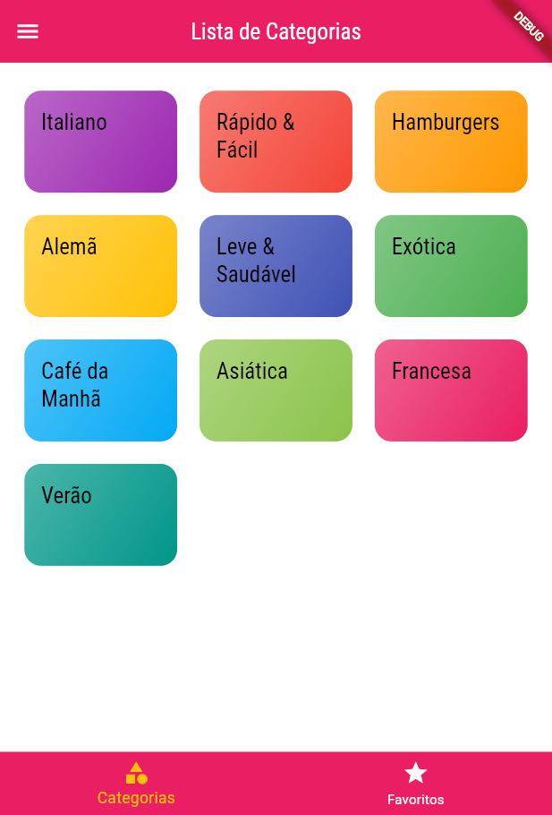
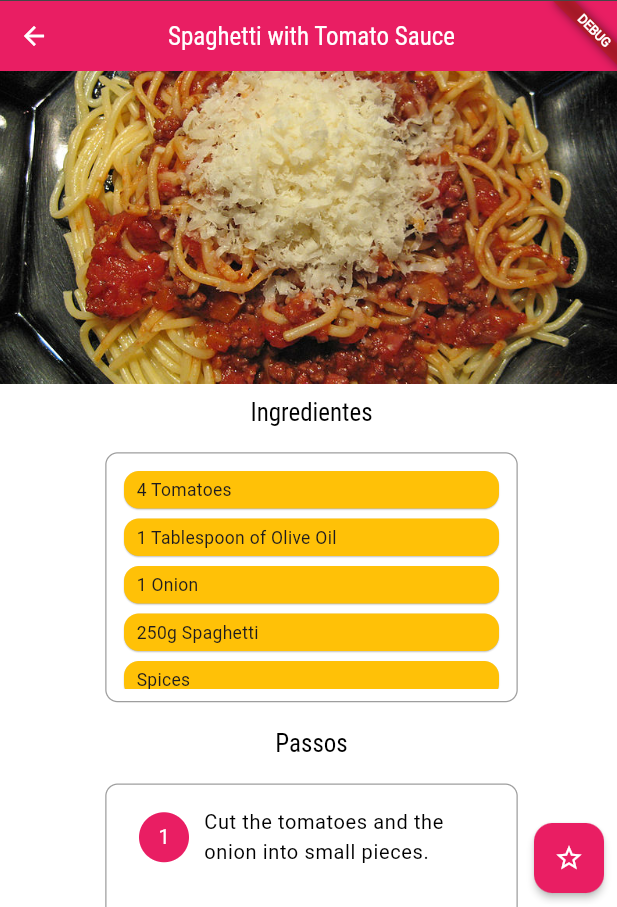
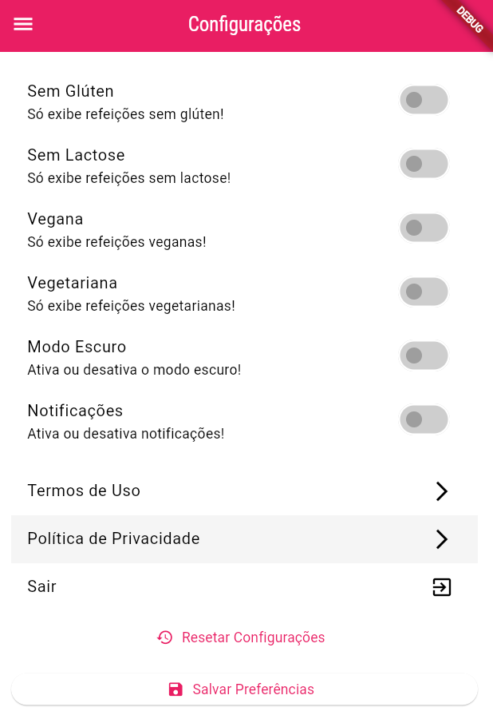
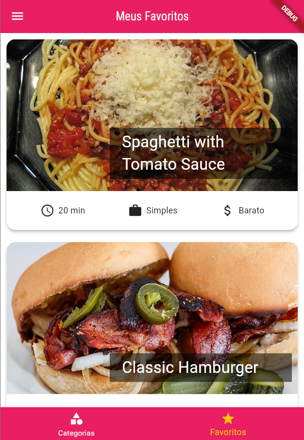

# 🍽️ Meals App

Aplicativo desenvolvido em Flutter para explorar e visualizar diversas receitas de refeições, com a possibilidade de filtrá-las por restrições alimentares e marcar favoritas.

## ✨ Funcionalidades

- ✅ Listagem de categorias de refeições.
- ✅ Visualização detalhada de cada refeição com ingredientes e passos.
- ✅ Filtros para dietas: sem glúten, sem lactose, vegana e vegetariana.
- ✅ Favoritar ou desfavoritar refeições.
- ✅ Navegação com abas (Tabs): categorias e favoritos.
- ✅ Configurações personalizadas de filtros.

## 📱 Tecnologias utilizadas

- **Flutter** >= 3.29.3
- **Dart** >= 3.7.2
- Gerenciamento de rotas com `Navigator`
- Compartilhamento de estado via `StatefulWidget` e `setState`
- Animação com `Hero` e `FadeInImage`

## 🚀 Como executar

1. Clone o repositório:

```bash
git clone https://github.com/RafaellaBarbosa/meals.git
cd meals_app
```

2. Instale as dependências:

```bash
flutter pub get
```

3. Execute o projeto:

```bash
flutter run
```

## 🛠️ Estrutura de pastas

```
lib/
├── components/
├── data/
├── models/
├── screens/
├── utils/
├── app.dart
└── main.dart
```

## 📸 Demonstração









> **Nota**: As imagens de placeholder são utilizadas quando há falha no carregamento das imagens reais.

## 🤝 Contribuições

Contribuições são bem-vindas! Sinta-se à vontade para abrir **issues** ou enviar **pull requests**.
